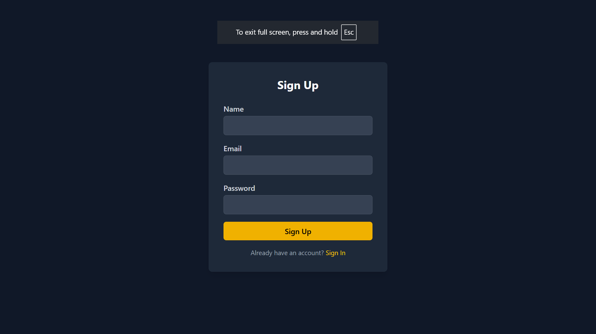
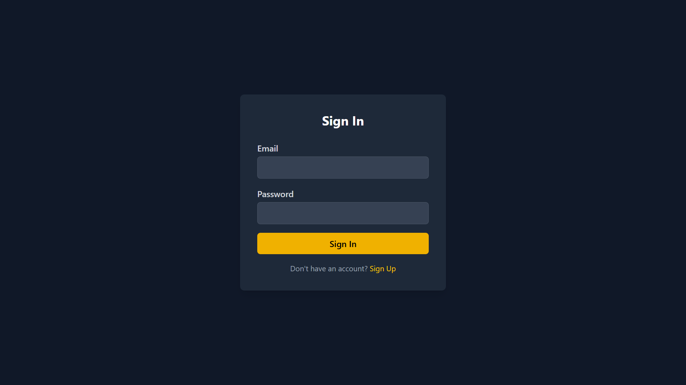
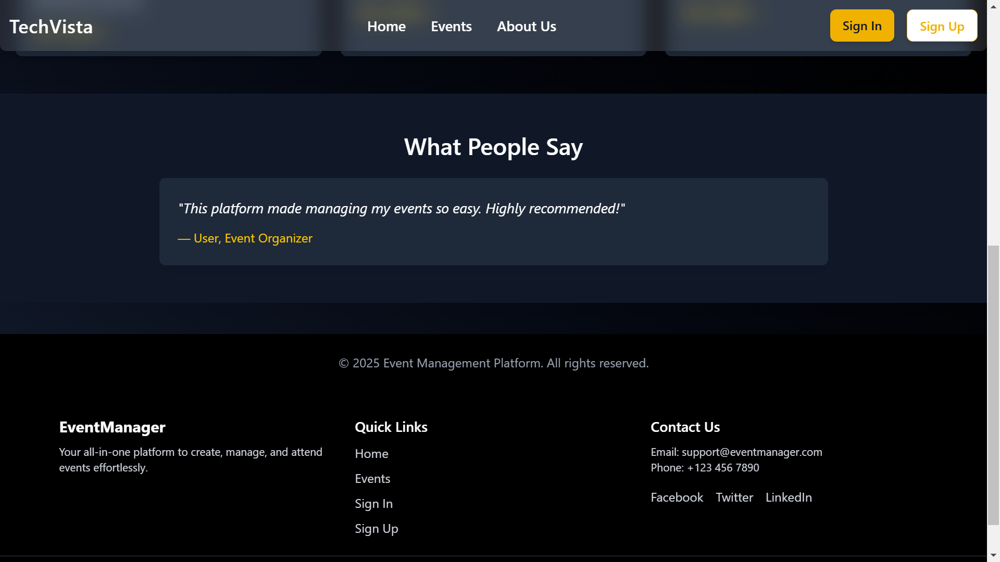
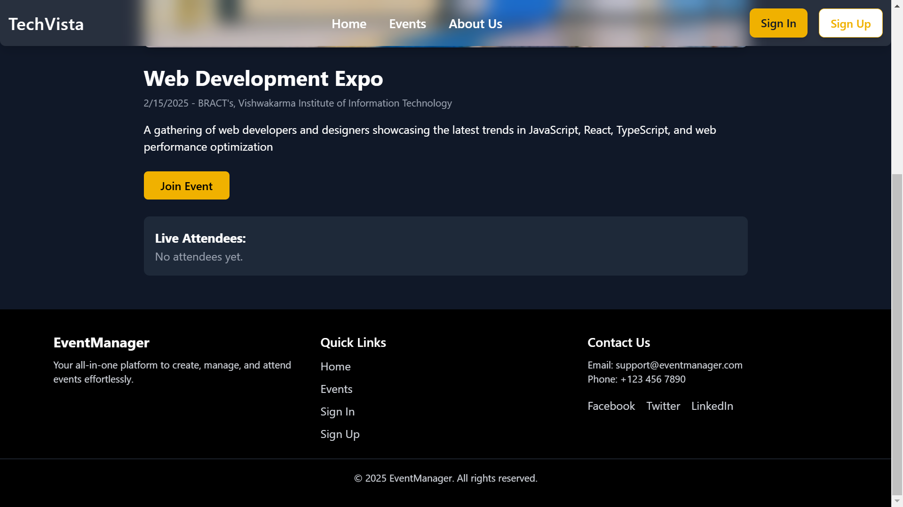
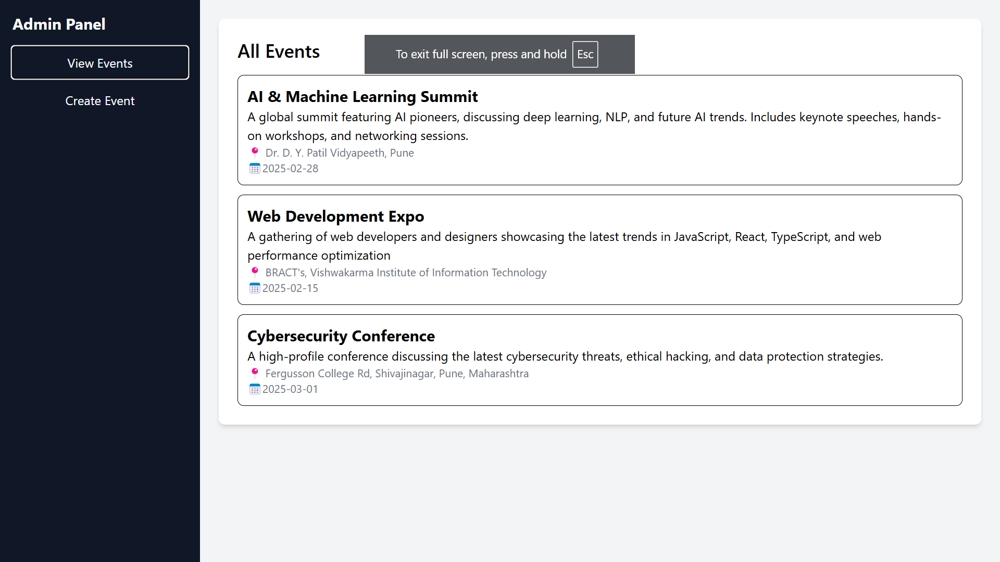
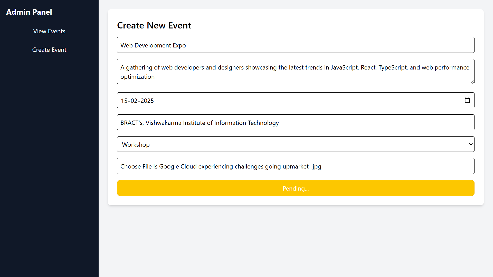
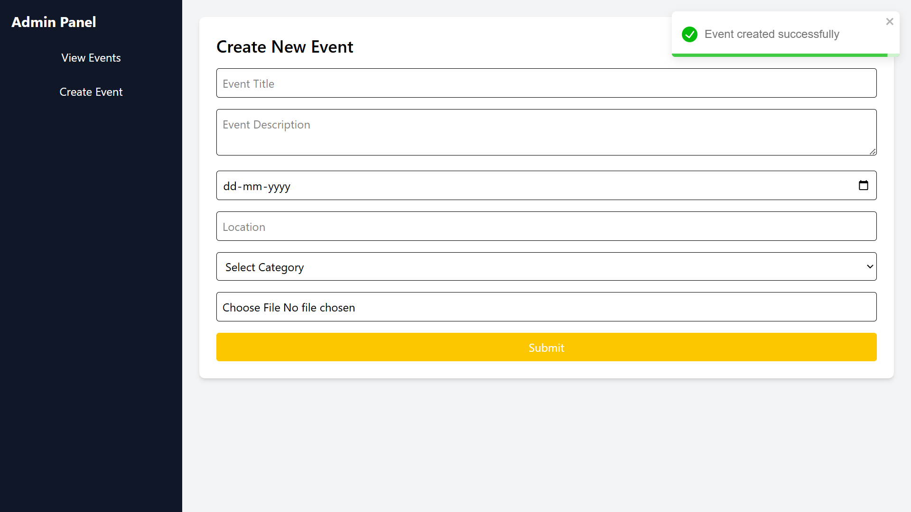

# TechVista - Event Management Platform

TechVista is a full-stack event management platform designed to help users create, manage, and view events seamlessly. The platform offers user authentication, event creation and management tools, and real-time updates for attendees. Built with modern web technologies and deployed on free-tier hosting services, TechVista provides a user-friendly experience for both event organizers and attendees.


## Key Features
- User Authentication: Secure login and registration system for users.

- Event Creation & Management: Easily create, update, and delete events.

- Responsive Design: Optimized for both desktop and mobile devices.

## Technologies Used
- Frontend: React.js, Tailwind CSS

- Backend: Node.js, Express.js

- Database: MongoDB

- Real-Time Updates: Socket.io

- Authentication: JWT (JSON Web Tokens)

## Getting Started

1.Clone the repository:

```bash
  git clone https://github.com/Mauli1022/Event-Management-Project.git
```
2.Install dependencies for both frontend and backend:

```bash
  cd TechVista/frontend && npm install
  cd ../backend && npm install
```
3.Set up environment variables for the backend (e.g., MongoDB connection string, JWT secret).

4.Run the backend server:

```bash
  npm start
```
5.Run the frontend development server:
```bash
  cd ../frontend && npm start
```
6.Open your browser and navigate to  http://localhost:5173.


## Sample Screen Shots










